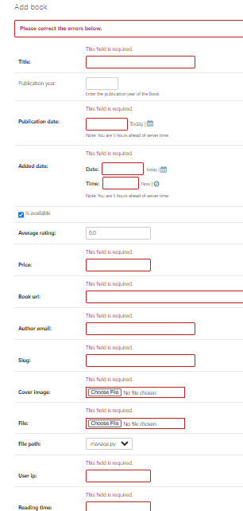

# Django Models #
## Fields
Fields are the datatypes on ehich the field is stored in database.I implemeneted all 26 django fields which maily include 
* AutoField
* IngeterField 
* BooleanField
* CharField
* TextField
* EmailField
* Decimal Field
* FileField
* DateField
* DateTimeField
* DurationField
* ImageField
* FilePathField
* GenericIpAddressField
* EmailField
* UrlField 
##

## Properties
Poperities are the charterstics on which the field input is acceptable. I
implemented all commonly use properites of fields which include   
* primary-key
* auto-icreament
* choice
* max_length
* default
* black
* Editable
* help_text
* max_digits
* decimal_places
* Unique
##
## Validators
Validators are used to validate the input field. I implemented validators and created a custom validator too, validators include
* minvalue validator
* maxvalue validator
* email validator
* Fileextension Validator
##

## Model Propeites
Created model properties which inclde getter and setter functions
## 
## Static Method and Class Methods
Created static methods and class methods. Class Methods take cls argument
##

## Dunder methods
Dunder methods are called automatically when the object is made we use __ str __ because at admin side the name is returned
##
## Database Engine
I used mysql for database and made changes in settings.py and give my database name, root, password, host and port
##
### Register my models in Django admin so admin can add or delete
